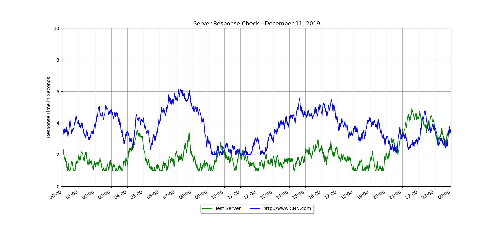

# plot 24 hour chart

A simple python module to generate plot to a png file of two values over 24 hours.  This is more of a reference to use matplotlib to generate the plot as I have found it to be a pretty useful format.   For example, This is used for generating daily server response time plots and emailing the results.

